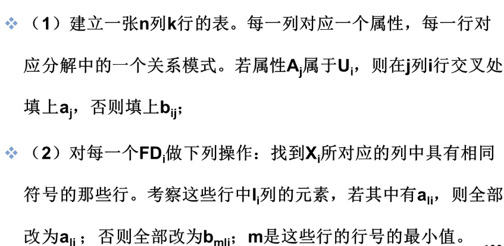
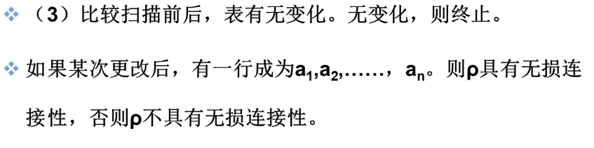
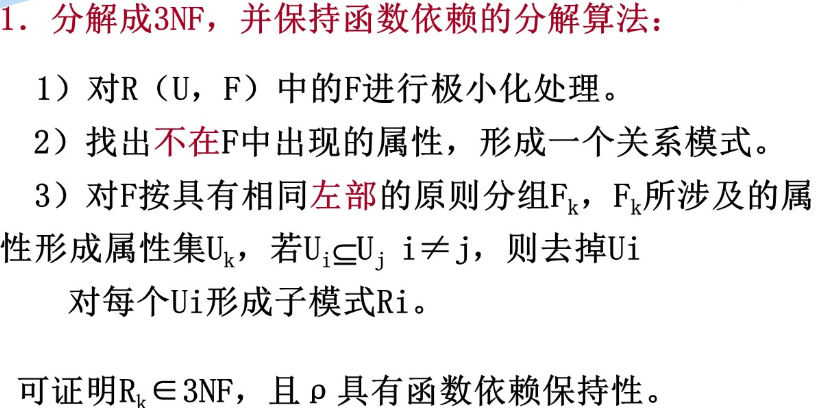
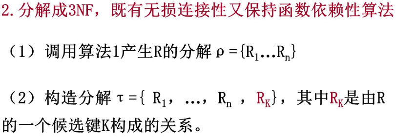
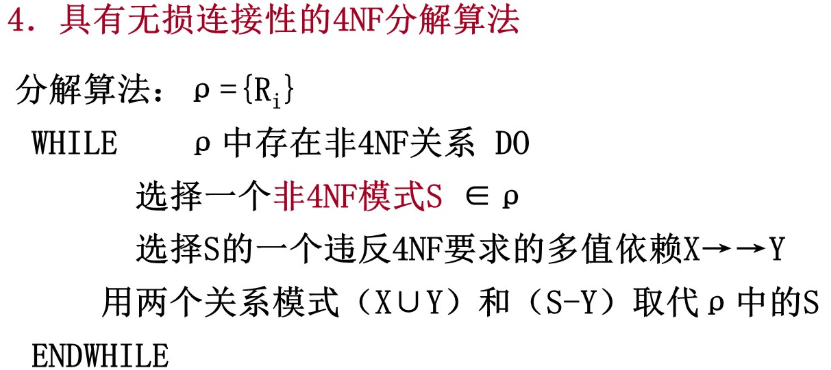
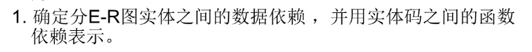
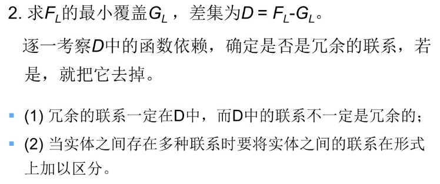
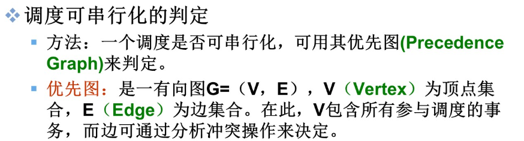
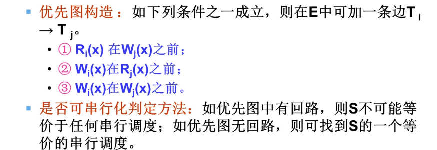
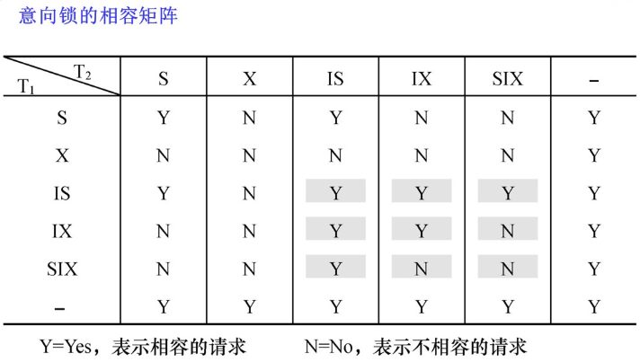

# 数据库系统概论
## 概述
---
### 四个基本概念
- 数据(data)：描述事物的**符号**记录称为数据
- 数据库(DB)：**长期储存**在计算机内的，**有组织的**、**可共享**的大量数据的集合。
- 数据库管理系统(DBMS)：计算机基础软件。具有
    - 数据定义功能(DDL)，定义数据对象的组成和结构
    - 数据组织存储和管理
    - 数据操纵功能（DML），实现数据的增删改查
    - 数据库的事务管理和运行管理
    - 数据库的建立和维护功能
4. 数据库系统（DBS）：由数据库（DB）、数据库管理系统（DBMS）、应用程序（APP）和数据库管理员（DBA）组成的存储、管理、处理和维护数据的系统。
### 数据的管理技术
人工管理阶段-->{文件系统阶段-->数据库系统阶段}（标志着数据库管理技术的飞跃）\
- 共享性提升、冗余度降低、物理独立性和逻辑独立性。数据统一管理。
- 数据管理技术的发展，与硬件、软件和应用需求有密切的联系。

### 数据库系统的特点
- 数据结构化
- 数据共享性高、冗余度低且易扩充
- 数据独立性高 
    * 物理独立性：应用程序与数据库中数据的物理存储相互独立。
    * 逻辑独立性：应用程序与数据库的逻辑结构相互独立。
- 数据由数据库管理系统统一管理和控制


## 数据模型——数据库系统的<font color="pink">核心</font>和<font color="pink">基础</font>
---
### 两类数据模型
- 概念模型
   按用户的观点来对数据和信息建模
- 逻辑模型和物理模型
    * 逻辑模型：按计算机系统的观点对数据建模。包括层次模型、网状模型、关系模型、面向对象模型、对象关系数据类型、半结构化数据类型等
    * 物理模型：数据在系统内部的表示方式和方法
    * 逻辑模型到物理模型的转换，主要由**数据库管理系统**实现
### 概念模型
1. 基本概念
   - 实体：客观存在并可区分的事物
   - 属性：实体具有的某一特性
   - 码：唯一标志实体的属性
   - 实体型：用实体名及其属性名集合来刻画和抽象同类实体。
   - 联系： 实体之间的联系，通常指不同实体集之间的联系。
2. 一种表示方法：实体-联系方法，也称为E-R模型
### 数据模型的组成要素
- 数据结构
- 数据操作
- 数据的完整性约束条件
### 层级模型
- 典型代表：IBM公司的IMS
- 有且只有一个节点没有双亲结点，这个节点称为根节点。
- 根以外的其他节点有且只有一个双亲结点。
- 优点：
  * 数据结构简单清晰
  * 层次数据库的查询效率高
- 缺点：
  * 现实世界很多联系非层次
  * 一个结点具有多个双亲结点时的表示、编写程序复杂
  * 查询子女结点必须通过双亲结点
  * 层次命令结构化
### 网状模型
- 典型代表：DBTG系统，也称CODASYL系统。
- 允许一个以上的结点无双亲
- 一个节点可以由多于一个的双亲
- 优点
   * 可以更为直观的描述现实世界
   * 良好的性能、存取效率较高
- 缺点
   * 结构较复杂
   * DDL、DML复杂
   * 应用程序访问数据必须选择适当的存取路径，用户必须了解系统结构细节，加重编写应用程序负担。
### 关系模型
- 术语：
   * 关系：对应一张表
   * 元组：表中的一行
   * 属性：表中的一列
   * 码：某个属性组，唯一确定一个元组
   * 域：一组具有相同数据类型是的集合
   * 关系模式：对关系的描述
- 优点
   * 与格式化模型不同，建立在严格的数学概念基础上
   * 数据独立性保密性更高
   * 概念单一、结构简单、清晰
   * 存取路径对用户透明
- 缺点
   * 查询效率不如格式化模型数据


## 数据库系统的结构
---
### 模式
- 模式是相对稳定的，实例是相对变动的
### 三级模式结构
1. 模式，也称逻辑模式，是所有用户的公共数据视图，模式不涉及物理存储和硬件环境，与应用程序和开发环境无关。
2. 外模式，也称子模式或用户模式，数据库用户的数据视图，**外模式通常是模式的子集**。
3. 内模式，也称存储模式，是数据在数据库内部的组织方式
### 二级映象功能与数据独立性
- 数据独立性是指应用程序与数据库的数据结构之间相互独立
    * 在物理结构改变时，尽量不影响应用程序，称为物理数据独立性
    * 在逻辑结构改变时，尽量不影响应用程序，称为逻辑数据独立性

1. 外模式/模式映像
    模式改变时，可使外模式保持不变，保证逻辑独立性
2. 模式/内模式映像
    存储结构发生改变时，可使模式保持不变，保证物理独立性
- 数据库模式是数据库的**中心与关键**，应首先确定。
## 数据库系统的组成
---
1. 硬件平台及数据库
2. 软件
3. 人员
   - 数据库管理员
   - 系统分析员和数据库设计人员
   - 应用程序员
   - 用户
        * 偶然用户
        * 简单用户
        * 复杂用户

## 关系数据库结构及定义
---
在数据库中存储的是**数据以及数据之间的联系**。
### 定义
- 域
- 笛卡尔积
   * 元组和分量
   * 基数：一个域允许的不同取值的个数
- 关系
    * 关系的度（单元关系，二元关系）
    * 候选码（能唯一表示一个元组的属性集）——>挑一个作为主码
    * 主属性：候选码的诸属性
      其余——非主属性或非码属性
    * 全码：关系模式的所有属性是这个关系模式的候选码
    * 三种类型：
        - 基本关系，又称基本表
        - 查询表
        - 视图表
    * 六条性质：
        - 行的顺序无所谓
        - 列的顺序无所谓
        - 列是同质的
        - 不同列可出自同一域
        - 任意两个元组候选码不同
        - 分量必须取原子值（最基本的一条，满足即为第一范式）
### 关系模式
* 关系模式是**静态**的、**稳定**的，而关系是动态的
### 基本关系操作
- 查询操作
    * 选择
    * 投影
    * 并
    * 差
    * 笛卡尔积//以上5种基本数据操作
    * 连接
    * 除
    * 交
- 插入、删除、修改操作
### 结构化查询语言SQL
集
- 查询
- 数据定义语言
- 数据操纵语言
- 数据控制语言
于一体的关系数据语言。


## 关系的完整性
---
1. 实体完整性：若属性A是关系R的主属性，则A不能取空值。
2. 参照完整性：若属性F是关系R的外码，它与基本关系S的主码相对应，则对于R上的每一个元组在F上的值应该或者取空值、或者取S中某个元组的主码值。
3. 用户定义的完整性
- 实体完整性和参照完整性是关系的两个不变性。


## 关系代数
---
### 传统集合运算
- 并
- 差
- 交
- 笛卡尔积
### 关系运算
象集：给定关系R（X,Z）,x在R中的象集为Zx，表示R中属性组X上的属性值为x的诸元组在Z上分量的集合，是**属性组值**的子集
关系运算的定义：

- 选择
- 投影
- 连接 
  常用：
    * 等值连接
    * 自然连接，一种特殊的等值连接，它要求两个关系中进行比较的分量必须是同名的属性组，并且在结果中把重复的属性列去掉。
    * 外连接：保留悬浮元组
        - 左外连接：只保留左边关系的悬浮元组
        - 右外连接：只保留右边关系的悬浮元组
- 除：若T为R除以S的结果，则T包含所有在R中而不在S中的属性及其值，且T与S的所有组合均在R中。


## SQL
---
### SQL的特点
1. 综合统一
2. 高度**非过程化**
3. **面向集合**的操作方式
4. 以同一种语法结构提供**多种使用方式**：交互式和嵌入式
5. 语言简洁，易学易用
### SQL的基本概念
- 外模式包括视图和若干基本表，模式包括若干基本表，内模式包括若干存储文件。
- 在关系数据库管理系统中一个关系就对应一个基本表。一个或多个表对应一个存储文件，一个表可以带若干索引。索引也放在存储文件当中。
### 数据定义
#### 模式的定义与删除
- 建立模式
```sql
CREATE SCHEMA <模式名> AUTHORIZATION <用户名>
[<表定义子句>|<视图定义子句>|<授权定义子句>];
```
- 删除模式
```sql
DROP SCHEMA <CASCADE|RESRICT>;
```
#### 基本表的定义、删除与修改
- 创建表
```sql
CREATE TABLE <表名> (
<列名><数据类型>[<列级完整性约束条件>]
[,<列名><数据类型>[<列级完整性约束条件>]]
...
[,<表级完整性约束条件>]
);
```
- 模式与表
    1. 在表中给出模式名，如CREATE TABLE "<模式名>".<表名>
    2. 创建模式语句同时创建表
    3. 设置所属模式，如下
```sql
SHOW search_path; #显示当前搜索路径
SET search_path TO "<模式名>",PUBLIC; #设置搜索路径
CREATE TABLE <表名>();
```
- 修改基本表
```sql
ALTER TABLE <表名>
[ADD [COLUMN] <新列名><数据类型> [完整性约束]]
[ADD <表级完整性约束>]
[DROP[COLUMN]<列名>[CASCADE|RESCTICT]]
[DROP CONSTRAINT<完整性约束名>[CASCADE|RESTRICT]]
[ALTER COLUMN <列名><数据类型>];
```
- 删除表
```sql
DROP TABLE <表名> [RESTRICT|CASCADE];
```
#### 索引的建立与删除
- 建立索引
```sql
CREATE [UNIQUE] [CLUSTER] INDEX <索引名>
ON <表名>(<列名>[<ASC|DESC>][,<列名>[<ASC|DESC>]]...);
```
- 修改索引
```sql
ALTER INDEX <旧索引名> RENAME TO <新索引名>;
```
- 删除索引
```sql
DROP INDEX <索引名>;
```
### 数据操纵

#### 数据查询

- SELECT语句
```sql
SELECT [ALL|DISTINCT]<目标列表达式>[,<目标列表达式>]...
FROM <表名或视图名> [,<表名或视图名>...]|(SELECT语句)[AS](别名)
[WHERE <条件表达式>]
[GROUP BY <列名1> [HAVING <条件表达式>]]
[ORDER BY <列名2> [ASC|DESC]];
```
  - tips
  1. SELECT * ----查询全部列
  2. 常用查询条件
      - =,>,<,>=,<=,<>,!>,!<;NOT+ 上述比较符
      - [NOT] BETWEEN AND
      - [NOT] IN
      - [NOT] LIKE
      - <font color="blue">IS </font>[NOT] NULL
      - AND,OR,NOT
  3. 聚集函数
      - COUNT(*)    ！！！不忽略空值NULL
      - COUNT([DISTINCT|ALL]<列名>)
      - SUM([DISTINCT|ALL]<列名>)
      - AVG([DISTINCT|ALL]<列名>)
      - MAX([DISTINCT|ALL]<列名>)
      - MIN([DISTINCT|ALL]<列名>)
  4. GROUP BY子句 + HAVING子句
- 连接查询
    1. 等值与非等值连接查询
    2. 自身连接（要给表取两个别名）
    3. 外连接
    4. 多表连接
    
- 嵌套查询
    相关定义：
    
    1. 一个SELECT-FROM-WHERE语句称为一个查询块，将一个查询块嵌套在另一个查询块的WHERE子句或HAVING短语的条件中的查询称为嵌套查询
    2. 外层查询又称父查询，内层查询又称子查询
    3. 子查询不能使用ORDER BY语句
    4. 不相关子查询：子查询的查询条件不依赖于父查询
    5. 相关子查询：子查询的查询条件依赖于父查询，不能一次性将子查询的结果求解出来，而是反复求值
    6. 嵌套查询中维持ANY/SOME表示任一，ALL表示所有（任意）
    7. 带有EXISTS谓词的子查询，产生ture或false。（！！！所有带有IN谓词，、比较运算符、ANY和ALL谓词的子查询都能用带EXISTS的子查询等价替代）
    8. 空值进行四则运算还是空值
    
- 集合查询--各查询结果列数必须相同，对应数据项的数据类型也必须相同
    * UNION--自动去掉重复元组，如要保留则用UNION ALL操作符。
    * INTERSECT
    * EXCEPT
    
- 派生表查询：子查询嵌套于FROM子句中。（！！！AS关键字可以省略，但必须为派生关系指定别名）

    
#### 插入数据

```sql
INSERT INTO <表名>[(<属性列1>[,<属性列2>]...)]
VALUES(<常量1>[,<常量2>]...);
```
或
```sql
INSERT INTO <表名>[(<属性列1>[,<属性列2>]...)]
子查询;
```
#### 修改数据

```sql
UPDATE <表名>
SET <列名>=<表达式> [,<列名>=<表达式>]...
[WHERE <条件>];
```
#### 删除数据

```sql
DELETE FROM <表名>
[WHERE <条件>];
```
### 视图——只存放定义，不存放数据
- 建立视图
```sql
CREATE VIEW <视图名> [<列名>[,<列名>]...]
AS <子查询>
[WITH CHECK OPTION];
```
创建视图时并不执行SELECT语句，对视图查询时，才将数据查出。
- 删除视图
```sql
DROP VIEW <视图名> CASCADE;
```
- 视图的作用
    1. 视图能够简化用户操作
    2. 视图使用户能以多角度看待同一数据
    3. 视图对重构数据库提供了一定程度的逻辑独立性
    4. 视图能够对机密数据提供安全保护
    5. 更加清晰地表达查询


## 数据库安全
---
### 数据库的不安全因素
- 非授权用户对数据库的恶意存储与破坏
- 数据库中重要或敏感的数据被泄露
- 安全环境的脆弱性
### 安全级别
4组、7个等级
D、C(C1,C2)、B(B1,B2,B3)、A(A1)
其中：C1级有了自主存取控制，B1级有了强制存取控制以及审计等安全机制。C2级数据库管理系统支持自主存取控制，B1级数据库管理系统支持强制存取控制。

### 用户身份鉴别--系统提供的最外层安全保护措施
- 静态口令鉴别
- 动态口令鉴别
- 生物特征鉴别
- 智能卡鉴别
### 授予与收回权限（控制类指令）--实现自主存取控制
- 用户权限由两要素组成：数据库对象和操作类型
- GRANT：授予用户对列的操作权限
```sql
GRANT <权限>[,<权限>]...
ON <对象类型><对象名>[,<对象类型><对象名>]...
TO <用户>[,<用户>]...
[WITH GRANT OPTION];
```
- REVOKE
```sql
REVOKE <权限>[,<权限>]...
ON <对象类型><对象名>[,<对象类型><对象名>]...
FROM <用户>[,<用户>]...
[CASCADE|RESTRINCT];
```
- 创建数据库模式的权限
```sql
CREATE USER <username> [WITH][DBA|RESOURCE|CONNECT];
```
### 数据库角色
- 数据库角色是被命名的一组与数据库操作相关的权限，角色是权限的集合。
- 创建角色
```sql
CREATE ROLE <角色名>;
```
- 给角色授权
```sql
GRANT <权限>[,<权限>]...
ON <对象类型> <对象名>
TO <角色>[,<角色>]...;
```
- 将一个角色授权给其他角色或用户
```sql
GRANT <角色1>[,<角色2>]...
TO <角色3>[,<用户1>]...
[WITH ADMIN OPTION];
```
- 角色权限的收回
```sql
REVOKE <权限>[,<权限>]...
ON <对象类型> <对象名>
FROM <角色>[,<角色>]...
```
### 强制存取控制
敏感度标记：TS>=S>=C>=P
规则：

- 仅当主体的许可证级别大于或者等于客体的密级时，改主体才能读取相应的客体。
- 仅当主体的许可证级别小于或者等于客体的密级时，改主体才能写相应的客体。
### 审计功能--一种事后检查的安全机制
- 记录一切**成功**和**不成功**的操作
-AUDIT/NOAUDIT
```sql
[NO]AUDIT <操作名>[,<操作名>]...
ON <表名>;
```
### 数据加密
1. 存储加密
2. 传输加密
### 其他安全性保护
- 推理控制
- 隐蔽信道
- 数据隐私保护


## 数据库完整性——数据库的正确性和相容性
---
1. 实体完整性
    1. 检查主码值是否唯一，如果不唯一则拒绝插入或修改
    2. 检查主码的各个属性是否为空，只要有一个空值就拒绝插入或修改。
2. 参照完整性

| （破坏参照完整性的）操作 | 违约处理 |
| ----------------| -------- |
| 参照表插入元组   | 拒绝     |
| 参照表修改外码值 | 拒绝     |
|被参照表删除元组|拒绝/级联删除/设置为空值|
|被参照表修改主码值|拒绝/级联删除/设置为空值|
3. 用户自定义的完整性
    1. 属性上的约束条件——不满足则拒绝执行
        - NOT NULL
        - UNIQUE
        - CHECK短语
    2. 元组上的约束条件——不满足则拒绝执行
### 完整性命令约束命名子句
- 完整性约束命名子句(新建表时)
```sql
CONSTRAINT <完整性约束条件名> <完整性约束条件>;
```
- 修改表中的完整性限制

删除完整性约束
```sql
ALTER TABLE <表名>
DROP CONSTRAINT <完整性约束条件名>;
```
增加完整性约束
```sql
ALTER TABLE <表名>
ADD CONSTRAINT <完整性约束条件名> <完整性约束条件>;
```
### 断言
- 通过声明断言来指定更具一般性的约束。可以定义涉及多个表或聚集操作的比较复杂的完整性约束，任何使断言不为真值的操作都会被拒绝执行。
- 创建断言语句
```sql
CREATE ASSERTION <断言名> <CHECK 子句>;
```
- 删除断言语句
```sql
DROP ASSERTION <断言名>;
```
### 触发器
- 定义触发器
```sql
CREATE TRIGGER <触发器名>
{BEFORE|AFTER} <触发事件> ON <表名>
REFERENCES NEW|OLD ROW AS <变量>
FOR EACH {ROW|STATEMENT}
[WHEN <触发条件>] <触发动作体>;
```
- 激活触发器，
    多个触发器时：
    1. 执行该表上的BEFORE触发器
    2. 激活触发器的SQL语句
    3. 执行该表上的AFTER触发器
- 删除触发器
```sql
DROP TRIGGER <触发器名> ON <表名>;
```


## 关系数据理论
---
### 相关术语
- 函数依赖：R(U)是属性集U上的关系模式，X，Y是U的子集。对于R的任意一个可能关系r，r中不可能存在两个元组在X上的属性值相等，在Y上的属性值不等，称Y函数依赖于X，记作X->Y。
    * 若Y$\subseteqq$X，为平凡的函数依赖。
- 部分函数依赖：X->Y，若对于X的每一个真子集X'，X'-/->Y，则称Y对X完全函数依赖，记作X$\frac{F}{}$>Y。**否则**称为部分函数依赖。
- 传递函数依赖：X->Y,**Y-/->X**，Y->Z(Z$\subsetneqq$Y，Y$\subsetneqq$X)，称Z传递函数依赖于X，记作X$\frac{传递}{}$>Z。
- 超码：K为R<U,F>中的属性或属性组合，K->U，称K为超码。
- 候选码：K$\frac{F}{}$>U,称K为候选码。(特殊的超码)
- 主码：选定的一个候选码。
- 全码：整个属性组是码。
- 主属性：包含在任何一个**候选码**中的属性。
- 非主属性/非码属性：不包含在任何候选码中的属性。
- 多值依赖：X，Y，Z是U的子集，且Z=U-X-Y，若给定一对(x,z)值，有一组Y值，这组值仅仅决定于x值而与z无关。称Y多值依赖于X，记作X->->Y。
- 闭包：$X^{+}_{F}$={A|X->A能由F导出}，$X^{+}_{F}$称为属性集X关于函数依赖集F的闭包。
- 最小依赖集/最小覆盖：
    1. 任一函数依赖右部仅含一个属性。
    2. 函数依赖个数精简到最少
    3. 函数依赖的左部精简到最少
### 范式
- 第一范式（1NF）：每一个分量都是不可分的数据项
- 第二范式（2NF）：1NF&**不**存在**非主属性**对任一**候选码**的**部分函数依赖**。
- 第三范式（3NF）：2NF&**不**存在**非主属性**对任一**候选码**的**传递函数依赖**。
    - 所有属性都是主属性的模式最高一定可以达到
- BC范式（BCNF）:每一个决定因素都包含码，消除了插入、删除的异常。满足：
    * 3NF
    * 所有主属性对于任一不包含它的码也是完全函数依赖
    * 没有任何属性完全函数依赖于非码的任何一组属性。
    * (全码组成的关系模式最高一定可以到达||3NF+唯一候选码||二元模式最高一定可以到达)
- 4NF：属性之间不允许有**非平凡且非函数依赖**的多值依赖
- 判断范式
    1. 求候选码
       1. 如果有属性只在函数依赖集的左边出现，则该属性一定包含在候选码中（继续求它的闭包，如果他的闭包是属性全集，则为候选码，如果不是，则需要结合其他属性求闭包，继而判断是否是候选码）
       2. 只在函数依赖集右边出现的属性，一定不属于候选码
       3. 对于左右都出现过的属性：
（1）先结合只在左边出现的属性求闭包，看看是否包括所有属性，如果他的闭包是属性全集，则为候选码；
（2）如果没有包括所有属性，就结合其他左右都出现的求闭包，看看是否包括所有属性，如果他的闭包是属性全集，则为候选码
       1. 如果有属性不在函数依赖集中出现（外部属性），那么一定包含在候选码中（继续求它的闭包，如果他的闭包是属性全集，则为候选码，如果不是，则需要结合其他属性求闭包，继而判断是否是候选码）
    1. 分主属性、非主属性
    2. 判断范式。  
### 规范化
1NF$\frac{消除非主属性对码的部分函数依赖}{}$>2NF$\frac{消除非主属性对码的传递函数依赖}{}$>3NF$\frac{消除主属性对码的部分和传递函数依赖}{}$>BCNF$\frac{消除非平凡且非函数依赖的多值依赖}{}$>4NF

### 函数依赖的公理系统
- 推理规则——Armstrong公理系统
  - 自反率：
    若Y$\subseteqq$X$\subseteqq$U，则X——>Y被F所蕴含
  - 增广率：
    若X——>Y被F所蕴含，且Z$\subseteqq$U，则XZ——>YZ被F所蕴含
  - 传递率：
    若X——>Y及Y——>Z被F所蕴含，则X——>Z被F所蕴含
### 模式的分解
#### 无损连接性
- 保证不丢失信息
- 判断无损连接


#### 保持函数依赖性
- 减轻或解决各种异常情况
- 判断保持函数依赖：
    1. 求投影F'=F1∪F2∪...Fn是否包含全部函数依赖。
    2. 对于缺少的函数依赖，求左侧属性在判断F'中的闭包是否蕴含右侧。（$F'^{+}$==$F^{+}$?）
### 模式分解算法
- 保持函数依赖，最多可以达到3NF。
- 保持无损连接性，最多可以达到4NF。
- 保持函数依赖和无损连接性，最多可以达到3NF




## 数据库设计
---
### 六个阶段
1. 需求分析阶段
2. 概念结构设计阶段
3. 逻辑结构设计阶段——将概念结构转化为数据模型
4. 物理结构设计阶段——为逻辑设计模型选取一个最适合应用的物理结构（包括**存储结构**和**存取方法**）
5. 数据库实施阶段
6. 数据库运行和维护阶段
### 需求分析阶段
- 重点是“数据”和“处理”
#### 数据字典
概念：数据字典是关于数据库中数据的描述，即元数据，而不是数据本身。通常包括数据项、数据结构、数据流、数据存储和处理过程几个部分。
- 数据项：数据的**最小组成单位**。通常包含以下内容：
    数据描述={数据项名，数据项含义说明，别名，数据类型，长度，取值范围，取值含义，与其他数据项的逻辑关系，数据项之间的联系}\
    其中，数据范围和与其他数据项的逻辑关系定义了数据的完整性约束条件。
- 数据结构：反映了数据之间的组合关系。通常包含以下内容：
    数据结构={数据结构名，数据说明，组成：{数据项或数据结构}}
- 数据流：数据结构在系统内的传输路径。通常包含以下内容：
    数据流={数据流名，说明，数据流来源，数据流去向，组成：{数据结构}，平均流量，高峰期流量}
- 数据存储：数据结构停留或保存的地方，也是数据流的来源和去向之一。通常包含以下内容：
    数据存储描述={数据存储名，说明，编号，存入的数据流，输出的数据流，组成：{数据结构}，数据量，存取频度，存取方式}
- 处理过程：处理过程的具体逻辑通常用判定表或判定树来描述。通常包含以下内容：
    处理过程={处理过程名，说明，输入：{数据流}，输出：{数据流}，处理：{简要说明：主要说明功能和处理要求，处理要求是后面物理设计的输入及性能评价的标准}}
### 概念结构设计
- E-R图
  1. 实体型用矩形表示
  2. 属性用椭圆型表示
  3. 联系用菱形表示
- 实体与属性的划分：
现实世界的事务能作为属性的尽量作为属性对待。
属性的两条准则：
    * 属性不能再具有不能描述的性质
    * 属性不能与其他实体有联系。
- E-R图的集成：两步走
    1. 合成E-R图，生成初步的E-R图
        * 各子系统E-R图之间的冲突：
            1. 属性冲突
               - 属性域冲突
               - 属性取值单位冲突
            2. 命名冲突
               - 同名异义
               - 异名同义
            3. 结构冲突
               - 同一对象在不同应用中具有不同的抽象
               - 同一实体在E-R子图中所包含的属性个数和属性排列顺序不完全相同
               - 实体之间的联系在不同E-R子图中呈现不同的类型
    2. 消除不必要的冗余，生成基本E-R图
       - 分析方法
           - 以数据字典和数据流图为依据
           - 根据数据字典中关于数据项之间的逻辑关系
       - 规范化理论——根据函数依赖理论
        
        
### 逻辑结构设计
- E-R图向关系模型的转换
实体型之间的联系有以下不同的情况：
  1. 一个1：1的关系模式可以转换为一个独立的关系模式，也可以与任意一端对应的关系模式合并
  2. 一个1：n的关系模式可以转换为一个独立的关系模式，也可以与n端对应的关系模式合并
  3. 一个m:n联系转化为一个关系模式
  4. 三个或者三个以上的实体间的一个多元关系可以转换为一个关系模式
  5. 具有相同码的关系模式可以合并
- 数据模型的优化——以规范化理论为指导
    - 优化数据模型的方法
        1. 确定数据依赖
        2. 消除冗余的联系
        3. 确定所属的范式
        4. 按照需求分析阶段得到的各种应用对数据处理的要求，分析对于这样的应用环境这些模式是否合适。确定是否要对它们进行合并或者分解（！！！并不是规范化程度越高的关系越优）
        5. 按照需求分析阶段得到的各种应用对数据处理的要求，对关系模式进行必要的分解，以提高数据操作的效率和存储空间的利用率
    - 常用的分解方法
      - 水平分解
      - 垂直分解
- 设计用户子模式
### 物理结构设计
- 关系模式存取方法的选择
    - 索引方法
    - 聚簇方法
- 确定数据库的存储结构
    1. 确定数据的存放位置
    2. 确定系统配置
- 评价物理结构：主要是从定量估算各种方案的存储空间、存储时间和维护代价入手。
### 数据库的实施和试运行
- 数据的载入和应用程序的调试
- 数据库的试运行：先小批量再大批量；做好数据库的转储和恢复工作。
### 数据库的运行和维护
1. 数据库的转储和恢复
2. 数据库的安全性、完整性约束
3. 数据库性能的监督、分析和改造
4. 数据库的重组织与重构造
    - 重组织：不修改原设计的逻辑和物理结构。
    - 重构造：部分修改数据库的模式和内模式


## 数据库恢复技术
---
### 事务的基本概念
- 事务的定义：用户定义的一个数据库操作序列，这些操作要么全做，要么全不做，是一个不可分割的工作单位。
- 事务通常以BEGIN TRANSACTION开始，以COMMIT（提交）或ROLLBACK（回滚）结束。
- 事务的ACID特性：
    - 原子性：事务是数据库的逻辑工作单位，事务中所包括的诸操作要么都做，要么都不做。
    - 一致性：事务执行的结果必须是使数据库从一个一致性状态变到另一个一致性状态。
    - 隔离性：对于并发执行而言，一个事务的执行不能被其他事务干扰。
    - 持久性：也称永久性，一个事务一旦提交，它对数据库中数据的改变就应该是永久的。
### 故障的种类
- 事务内部的故障：非预期的，不能由应用程序处理的。
    - 常见原因：
        1. 运算溢出
        2. 并发进程发生死锁而被选中撤销该事务
        3. 违反了某些完整性限制
    - 恢复操作：事务撤销（UNDO）：反向扫描日志文件，查找事务的更新操作执行逆操作
- 系统故障：称为软故障，指造成系统停止运转的任何事件，使得系统要重新启动
    - 常见原因  
        1. 特定类型的硬件错误
        2. 操作系统故障
        3. DBMS代码错误
        4. 系统断电
    - 恢复策略
        5. 正向扫描日志文件
        6. 发生系统故障时，事务未提交：强行撤销所有未完成的事务
        7. 发生系统故障时，事务已提交，但缓冲区的信息未完全写回到磁盘上：重做所有已提交的事务。
- 介质故障：称为硬故障，指外存故障。
    - 常见原因
        1. 磁盘损坏
        2. 磁头碰撞
        3. 操作系统的某种潜在错误
        4. 瞬时强磁场干扰
    - 恢复策略
        1. 装入数据库发生介质故障前某个时刻的数据副本
        2. 重做此时起的所有成功事务，将这些事务已提交的结果重新记入数据库。
    - 使用检查点改善恢复效率
    - 数据库镜像
- 计算机病毒
    - 人为故障或破坏的计算机程序，可以繁殖和传播，等同于介质故障。
### 恢复的实现技术
- 基本原理：冗余——利用存储在系统其他地方的冗余数据来重建数据库中已被破坏或不正确的那部分数据。
- 如何建立冗余数据？数据转储和登记日志文件
#### 数据转储
- 转储方式分类
  - 海量转储
  - 增量转储
- 转储状态分类
  - 动态转储
  - 静态转储

#### 登记日志文件——用来记录事务对数据库的更新操作的文件

- 登记内容（每个登记内容作为日志文件的一个日志记录）：
  - 各个事务开始标记
  - 各个事务结束登记
  - 各个事务的所有更新操作
- 日志记录内容
  - 事务标识
  - 操作类型
  - 操作对象
  - 更新前数据的旧值
  - 更新后数据的新值
- 作用：
  - 进行事务故障和系统故障恢复
  - 协助后备副本对介质故障进行恢复
- 登记日志文件时必须遵循两条原则：
  - 登记的次序严格按并发事务执行的时间次序。
  - 必须先写日志文件，后写数据库。


## 并发控制
---
### 概述
- 事务是并发控制的基本单位
- 并发操作带来的数据不一致性
  - 丢失修改
  - 读“脏”数据
  - 不可重复读/幻影现象
- 主要方法
  - 封锁
  - 时间戳
  - 乐观控制法
  - 多版本控制
### 封锁
- 排他锁/写锁（X锁）
- 共享锁（S锁）
- 封锁协议：
  - 一级封锁协议：修改数据之前必须加X锁，直到事务结束才释放——解决丢失修改
  - 二级封锁协议：读数据之前必须加S锁，读完后释放——解决读脏数据
  - 三级封锁协议：读数据之前必须加S锁，直到事务结束才释放——解决不可重复读
### 活锁和死锁

- 当两个（或多个）并发的事务分别等待对方释放封锁的资源，而使事务处于长期等待状态的现象称为死锁。

- 解决活锁的方法：先来先服务策略
- 解决死锁的两种方法：
  - 预防：
    - 一次封锁法:为了完成一个事务，一次性封锁所需要的全部表
    - 顺序封锁法:所有的事务约定都按相同的顺序来封锁表
  - 诊断与解除
    - 超时法
    - 事务等待图法
    
    
### 并发调度的可串行性——并发事务正确调度的准则
- 冲突可串行化是可串行化的充分条件
### 两段锁协议
- 事务分为两个阶段
    1. 扩展阶段，获得封锁
    2. 收缩阶段，释放封锁
- 事务遵守两段锁协议是可串行化的充分条件
### 封锁的粒度
- 封锁对象的大小称为**封锁粒度**，封锁对象可以是**逻辑对象**，也可以是**物理对象**
- 封锁粒度越大、数据库所能封锁的数据单元就越少，并发度就越小，系统开销越小；反之，封锁粒度越小、数据库所能封锁的数据单元就越多，并发度就越大，系统开销越大
- 多粒度封锁
  - 显示封锁：应事务要求直接加到数据对象上的锁
  - 隐式封锁：由于上级对象加锁而导致该数据对象加上了锁
- 意向锁
  - IX锁
  - IS锁
  - SIX锁
  
    
